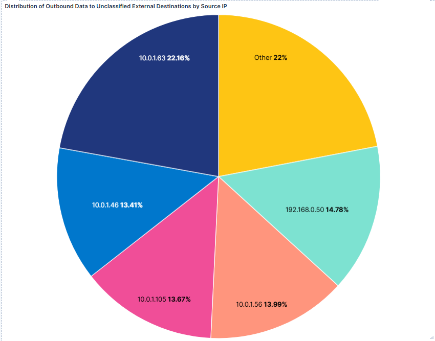
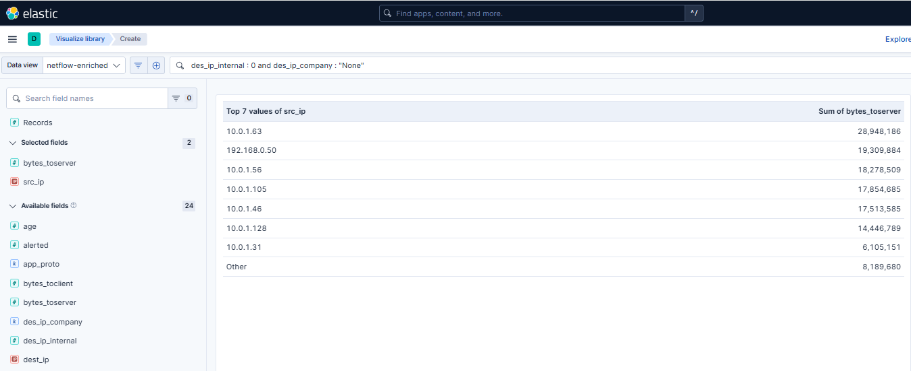
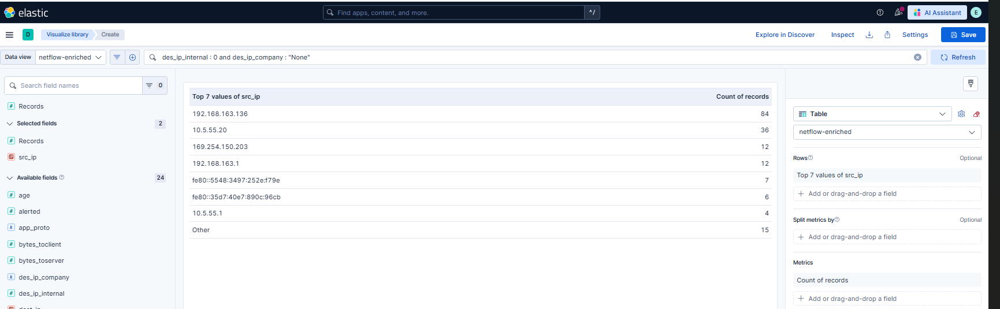
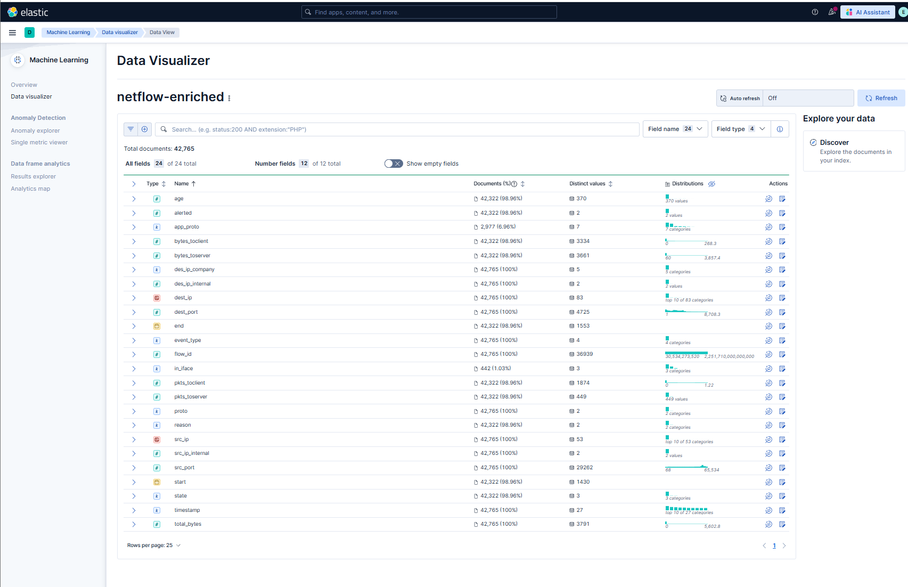
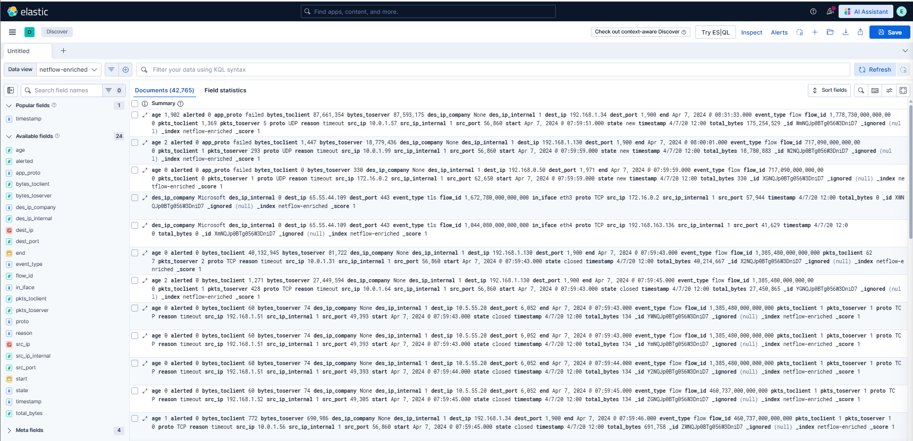

# Netflow Analysis & Enrichment with Elastic SIEM

## Project Overview
This project demonstrates a complete security analytics workflow: from raw network log enrichment using **Python** to advanced threat hunting and visualization in **Elastic SIEM (Kibana)**. The goal was to identify suspicious internal hosts involved in potential data exfiltration or abnormal outbound communication to unclassified external destinations.

## Objectives
- **Data Enrichment:** Automate the classification of raw Netflow logs using Python.
- **Threat Detection:** Identify high-volume data uploads to "None" (unclassified) external companies.
- **SIEM Integration:** Ingest enriched NDJSON data into Elastic Stack for security monitoring.
- **Behavioral Analysis:** Isolate hosts with suspicious connection frequencies and outbound data volumes.

## Technologies Used
- **Language:** Python 3.x (Pandas, Requests, JSON/NDJSON)
- **SIEM Platform:** Elastic Stack (Elasticsearch, Kibana)
- **Data Format:** Netflow v5/v9 (Enriched)
- **Environment:** Linux/Windows with Git Bash

## Enrichment Process
The raw netflow logs were processed through a custom Python ETL pipeline (`enrich_netflow.py`) to add critical security context:
- `src_ip_internal` / `dest_ip_internal`: Boolean flags for internal vs. external traffic.
- `dest_ip_company`: Automated ASN-based lookup to classify destinations (Microsoft, Google, Amazon, Facebook, or None).
- `total_bytes`: Aggregated flow volume for exfiltration analysis.

## Key Findings & Visualizations

### 1. Data Exfiltration Analysis (Outbound Volume)
Analysis revealed several internal hosts with significant outbound data transfers to unclassified external IPs.
- **Top Suspect:** `10.0.1.63` uploaded **~27.61 MB** to an unclassified destination.
- **Secondary Suspect:** `192.168.0.50` uploaded **~18.41 MB**.

<p align="center">
  
  <br><i>Figure 1: Distribution of Outbound Data to Unclassified External Destinations</i>
</p>

<p align="center">
  
  <br><i>Figure 2: Top 7 Internal Sources by Sum of Bytes Sent to External Destinations</i>
</p>

### 2. Connection Frequency (Suspicious Communication)
Using Kibana's Data Visualizer, we identified hosts with abnormally high connection counts, a common indicator of C2 (Command & Control) beaconing or scanning.
- **Host `192.168.163.136`** recorded **84 connections** to a single external IP.

<p align="center">
  
  <br><i>Figure 3: Top 7 Internal Sources by Connection Count</i>
</p>

### 3. SIEM Ingestion & Log Discovery
The enriched logs were successfully ingested into Elastic SIEM. The **Data Visualizer** confirmed the integrity of the 24 enriched fields across 42,765 documents.

<p align="center">
  
  <br><i>Figure 4: Elastic Data Visualizer Field Distribution for Enriched Netflow</i>
</p>

<p align="center">
  
  <br><i>Figure 5: Enriched Netflow Logs in Elastic Discover</i>
</p>

## How to Run
1. **Install Dependencies:**
   ```bash
   pip install -r requirements.txt